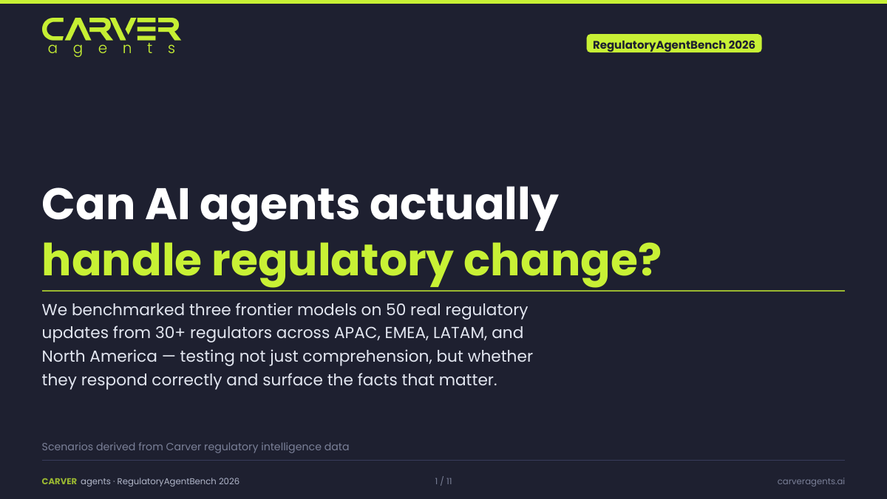

# RegulatoryAgentBench (RAB)

**A benchmark for evaluating AI agent responses to real-world regulatory change.**

RAB turns annotated regulatory updates into dynamic compliance scenarios — testing whether AI agents can not just *understand* regulatory change, but *act on it correctly*.

> **Design note:** RAB is inspired by Meta's [ARE (Agent Research Environments)](https://github.com/facebookresearch/meta-agents-research-environments), which introduced the idea of evolving, multi-step agent evaluation environments. RAB applies that framing to regulatory compliance: scenarios derived from real regulatory updates, with structured ground truth, typed actions, and a compliance workbench the agent must use to respond. RAB is a standalone implementation and does not depend on the ARE codebase.

---

## Why this exists

I've spent years watching compliance teams get buried under regulatory updates. Not because they don't care — they do — but because the volume is impossible. Hundreds of regulators, dozens of jurisdictions, updates arriving daily in five different languages with different calendar systems and different ideas about what a "deadline" means.

When AI agents started getting serious, the question I kept coming back to wasn't "can they read regulations?" — language models are already good at that. The real question is whether they can *respond* correctly: identify what changed, determine what your organisation needs to do, and surface the facts that actually matter to the people who have to act on it. That's a much harder problem, and as far as I could tell, nobody had actually measured it against real regulatory data.

So I built this. RAB uses real annotated regulatory updates — not synthetic scenarios, not toy examples — to evaluate whether AI agents can complete the compliance response loop from reading an update to taking the right action.

---

## Results

Benchmarked across 50 scenarios from 30+ regulators across APAC, EMEA, LATAM, and North America.



> Download: **[results/summary.pdf](results/summary.pdf)**

---

## Data & reproducibility

The sample scenarios in this repository are derived from a private regulatory intelligence dataset maintained by [Carver](https://carveragents.ai) and shared here with permission for reproducibility of the benchmark results.

- **[are_scenarios/sample-artifacts.json](are_scenarios/sample-artifacts.json)** — 50 raw annotated regulatory artifacts (selected from 100K+ across 700 regulators), showing the input data structure before scenario generation.
- **[are_scenarios/sample-scenarios.json](are_scenarios/sample-scenarios.json)** — the same 50 artifacts converted into simulation scenarios, showing the output of the scenario generation step.

> **Note on `process.py`:** The selection and scenario generation pipeline is not included in this repository. It assumes access to a private repository of regulatory annotations in the Carver annotation format. If you have your own regulatory annotation pipeline, you can implement the same two-step interface: a `select` command that filters annotations for simulation quality, and a `scenarios` command that converts them to the scenario format described below.

---

## How it works

```
Regulatory annotations  →  process.py select    →  selected_artifacts.json
                        →  process.py scenarios  →  are_scenarios.json
                        →  run_simulation.py run  →  results/<model>.json
                        →  run_simulation.py compare → side-by-side report
```

1. **`process.py select`** *(not included — requires private annotation data)* filters raw annotations down to high-signal simulation candidates — artifacts with clear actionables, compliance dates, and defined consequences. Stratified across impact × urgency × geography to avoid regional bias.

2. **`process.py scenarios`** *(not included)* calls an LLM to convert each annotation into a structured scenario with `required_actions`, `validation`, and `ground_truth`.

3. **`run_simulation.py run`** runs a single model against the scenario set via LiteLLM — works with OpenAI, Anthropic, Mistral, Llama, and any other LiteLLM-supported provider.

4. **`run_simulation.py compare`** produces a side-by-side report including consensus failure analysis.

---

## Quick start

```bash
# 1. Clone and install
git clone https://github.com/carveragents/RegulatoryAgentBench
cd RegulatoryAgentBench
pip install -r requirements.txt

# 2. Configure
cp example.env .env   # add your API key(s)

# 3. Run against the sample scenarios
python run_simulation.py run \
  --scenarios are_scenarios/sample-scenarios.json \
  --model gpt-5.4-mini-2026-03-17 \
  --output results/gpt5mini.json

# 4. Run another model
python run_simulation.py run \
  --scenarios are_scenarios/sample-scenarios.json \
  --model claude-sonnet-4-20250514 \
  --output results/claude.json

# 5. Compare with consensus failure analysis
python run_simulation.py compare \
  --results results/gpt5mini.json \
  --results results/claude.json \
  --show-consensus-failures
```

---

## Scenario structure

Each scenario in `are_scenarios.json` looks like:

```json
{
  "scenario_id": "...",
  "title": "FSC Taiwan: New reporting requirement for fund managers",
  "difficulty": "medium",
  "regulatory_context": {
    "regulator": "金融監督管理委員會",
    "jurisdiction": ["TW"],
    "update_type": "reporting_requirement",
    "compliance_deadline": "2026-03-31"
  },
  "situation": "...",
  "agent_task": "...",
  "required_actions": [...],
  "validation": {
    "must_identify": ["compliance deadline: 2026-03-31"],
    "must_act_on": ["reporting_change"],
    "must_not_miss": ["Q1 filing deadline", "penalty: TWD 1M per violation"]
  },
  "ground_truth": {
    "correct_action_types": ["reporting_change", "process_change"],
    "key_deadline": "2026-03-31",
    "penalty_summary": "..."
  }
}
```

---

## Repository structure

```
RegulatoryAgentBench/
├── rab/
│   ├── apps/
│   │   └── compliance_workbench.py   # action surface exposed to the agent
│   ├── scenarios/
│   │   └── loader.py                 # loads are_scenarios.json
│   ├── scorer.py                     # validation + scoring logic
│   └── __init__.py
├── are_scenarios/
│   ├── sample-artifacts.json         # 50 raw annotated regulatory artifacts
│   └── sample-scenarios.json         # same 50 converted to simulation scenarios
├── results/
│   ├── summary.pdf                   # slide deck (download)
│   └── summary.gif                   # animated preview (embedded in README)
├── tests/
│   └── test_scorer.py
├── run_simulation.py                 # main entry point (run + compare)
├── report.py                         # single-run results analysis
├── requirements.txt
├── example.env
└── README.md
```

---

## Scoring

| Dimension | Description |
|---|---|
| **Action coverage** | Did the agent identify all `must_act_on` action types? |
| **Fact extraction** | Did the agent surface all `must_identify` facts? |
| **Deadline accuracy** | Did the agent correctly identify `key_deadline`? |
| **Critical miss** | Did the agent miss anything in `must_not_miss`? |

**PASS** — action coverage = 100% and zero critical misses  
**PARTIAL** — action coverage ≥ 50% and ≤ 1 critical miss  
**FAIL** — everything else

---

## Difficulty tiers

| Tier | Criteria |
|---|---|
| **Hard** | High impact + high urgency, multiple jurisdictions or conflicting requirements |
| **Medium** | Medium impact or urgency, clear but non-trivial actionables |
| **Easy** | Low urgency, single jurisdiction, explicit requirements |

---

## License

MIT. See [LICENSE](LICENSE).

---

## Citation

```bibtex
@misc{rab2026,
  title  = {RegulatoryAgentBench: Evaluating AI Agent Responses to Regulatory Change},
  year   = {2026},
  url    = {https://github.com/carveragents/RegulatoryAgentBench}
}
```

Inspired by [Meta ARE](https://arxiv.org/abs/2509.17158).